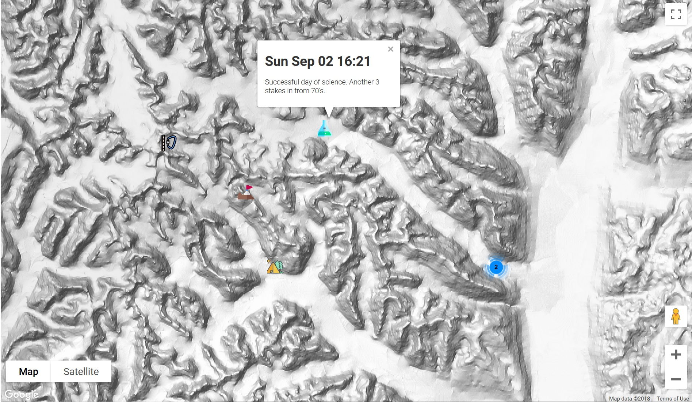

# README

LiveMap is a node.js application designed to allow a satellite phone to reproduce the behaviour of an InReach or Spot device, avoiding the need for an additional device/subscription costs or the additional weight and power requirements in remote field locations.

**[Check out a running demo](https://demolivemap.herokuapp.com/)**

The app can be deployed on a cloud server (tested working on AWS EC2 and using heroku), and once running it's as simple as sending a text message using a predefined syntax. The message will be parsed and posted on an online map (currently using google maps) which can be viewed directly or embedded in a website. The map is customisable with user defined map icons which can be selected using a letter code in each message.

### Motivation

Expeditions to remote location often carry a vast array of devices for communication and safety. A satellite phone and GPS device are vital pieces of equipment which most expeditions carry. Recently, numerous other bits of kit have been added to the list to simplify communication and allow friends, family and followers in the outside world to keep updated with progress in real time. However, a lot of these devices duplicate the capabilities of equipment which is already being carried at the expense of extra subscriptions and device costs, power requirements and weight.

InReach and SPOT devices are great for keeping family and friends updated, but are essentially a combined iridium modem (satellite phone) and a GPS. LiveMap brings similar functionality back to your satellite phone in an attempt to consolidate equipment and reduce cost, weight and power in the field.

The code was initially developed as part of the British Stauning Alps Greenland Expedition 2017 (mainly because we were too tight to buy yet another fancy device!). It's been updated and made more user friendly since then and is now freely available for others to use.

### Setup

The simplest setup is to fork this repository, create an account on heroku and push to your new heroku repository. You can find plenty of tutorials for using heroku online. You'll also need to get API keys for twitter and configure the app to use your twitter account details.

Basic configuration can be found in the config.ini file, here you can set twitter usernames etc and define the icons you'd like on your map. New icons can be found online, [flaticon](https://www.flaticon.com/) is a good source of svg images which work with LiveMap.

NB. Twitter API keys should be set in the app environment and should not be hardcoded anywhere!

I will continue to improve and update the documentation to include more detailed instructions when I can.

### Message syntax:

Messages consist of four components:
1. A letter defining the icon to be displayed on the map (case insensitive).
2. Decimal latitude of your location from your GPS (accuracy is up to user).
3. Decimal longitude (as above).
4. Message text using remaining characters in message.

The message components are split by a "\*" (a character which is easy to type on a satphone keypad, but unlikely to appear in a typical message text). Otherwise, there are no character limits other than the total message length, allowing flexibility in lat/lon accuracy and longer icon definitions if desired.

##### Example message:

A\*74.452\*2.3455\*This message will appear at the location specified and tells everyone what an awesome time we've had.

Check out a running demo version [here](https://demolivemap.herokuapp.com/).

### Try it:

The demo map above is linked to @DemoLiveMap on twitter; send a DM to the account and your message will be posted on the map in real-time!

(I will add a filter in future so you can limit posts on the map to specific users.)

#### Note: The application currently relies on the Twitter API to route SMS messages, recent updates have begun to limit some functionality and access to developer accounts. The application has been updated to use the latest API and retains all functionality (as of Aug 2018), but you should check updates to the Twitter API to ensure that it won't stop working while you're away in the field! I'm currently investigating options to route SMS messages without using twitter...

### Thanks to...

All members of the Stauning Alps Expedition, who contributed to code development and the interface/icon display on the maps, as well as to an excellent and successful expedition which you can read more about in our (report)[].

All of the sponsors and providers of grants to the expedition (full list [here]()).

[This blog](https://blog.safe.com/2014/03/twitter-stream-api-map/) and associated code provided the starting point for LiveMap and without it things would have been very difficult!
